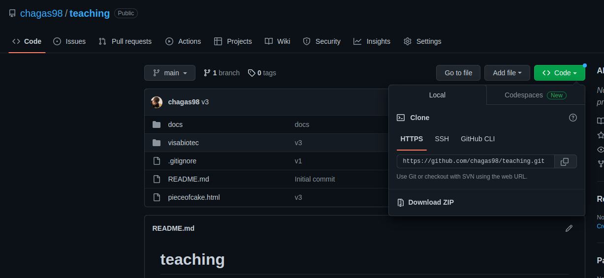
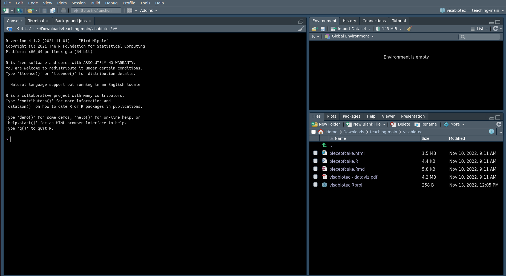
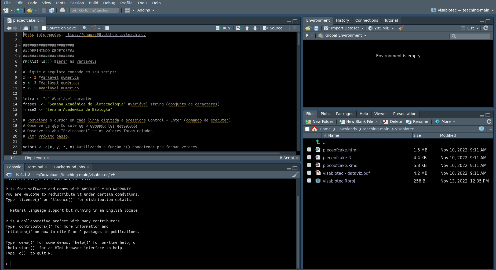
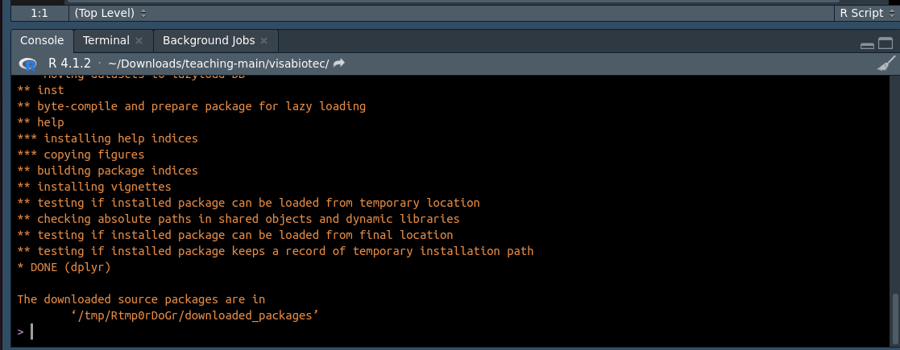
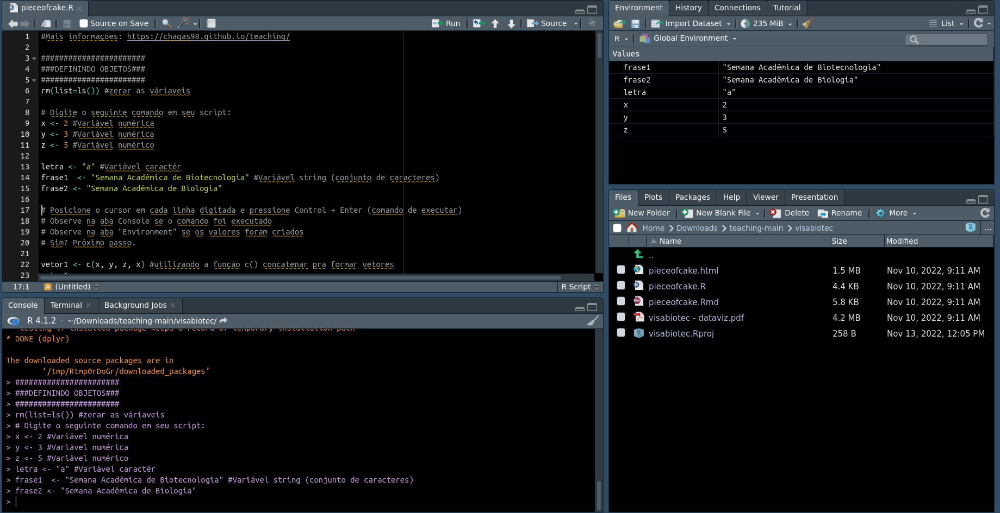
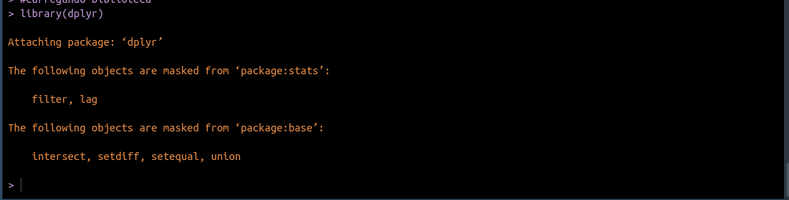
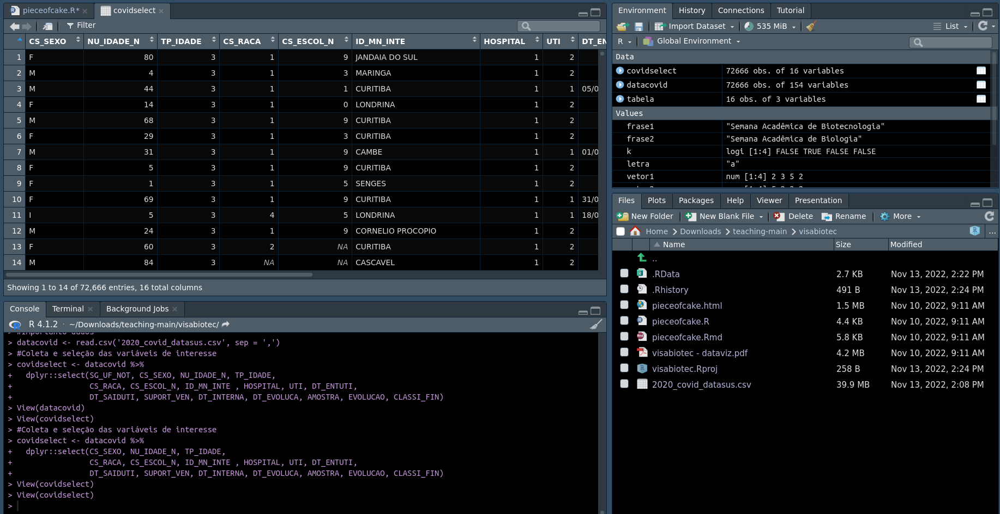
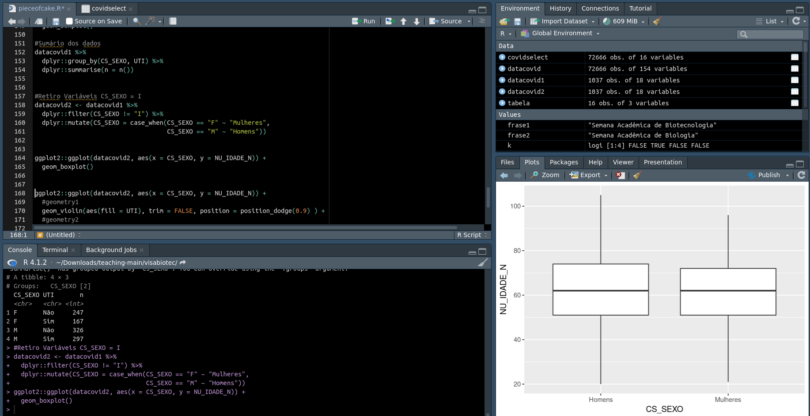

# Tutorial - Passos para Fazer em Casa

## Download R & RStudio

Utilizaremos a linguagem R a partir da interface do RStudio. Para baixar ambos, acesse o tutorial disponível [em portugês](https://edisciplinas.usp.br/pluginfile.php/4883125/mod_resource/content/1/Tutorial.pdf) ou [em espanhol](http://www.upm.es/sfs/Rectorado/Gabinete%20del%20Rector/Notas%20de%20Prensa/2015/05/documentos/Instrucciones%20de%20instalaci%C3%B3n%20de%20R%20y%20RStudio.pdf).

Caso sua preferência seja mais visual, é possível acompanhar um vídeo tutorial em [português](https://www.youtube.com/watch?v=6iZj3k9EBc4&t=441s&ab_channel=RLadiesBeloHorizonte) ou [espanhol](https://www.youtube.com/watch?v=D9Bp11iZssc&ab_channel=HanselOchoaMontero).


## Download Arquivos e Configuração

**Passo 1:** Acesse esse [link](https://github.com/chagas98/teaching). Clique em `Code` e faça o Download da pasta .zip conforme a imagem. Vá até a pasta onde salvou o arquivo .zip, clique com o botão direito do mouse e extraia os arquivos.


```{r, echo=FALSE}

```


**Passo 2:** Abra a pasta extraída `teaching-main`. Na pasta `visabiotec`, clique com o botão direito do mouse em `visabiotec.Rproj`, *abrir com* RStudio. Após essas etapas, você encontrará o projeto aberto conforme a imagem. As vezes algumas configurações podem ser diferente e as janelas se organizarem de forma diferente, mas funcionam da mesma forma.

```{r, echo=FALSE}

```
Observação: No canto inferior direito, você encontrará a lista de arquivos que pertencem a esseprojeto. O `pieceofcake.html` é o arquivo .html que você está lendo, pode ser aberto com seu browser (*abrir com* e selecione seu navegador de preferência). O `pieceofcake.Rmd` é um arquivo RMarkdown que foi utilizado para criar o arquivo .html, você pode abrir com o RStudio se quiser conferir. O arquivo `visabiotec - dataviz.pdf` é a apresentação de slides do minicurso. Por fim, o arquivo `pieceofcake.R` é nosso script R executável que utilizaremos. 

**Passo 3:** No canto inferior direito, na lista de arquivos, abra o arquivo `pieceofcake.R` clicando uma vez em cima do seu nome. O script será aberto conforme a figura abaixo. 

```{r, echo=FALSE}

```


**Passo 4:** Na aba `Console`, abaixo do script R, copie e cole os seguintes comandos na linha onde se encontra o simbolo `>` (deixe carregar, pode levar algum tempo, quando finalizar o simbolo `>` aparecerá novamente):


```

install.packages('dplyr')
install.packages('ggplot2')
install.packages('ggthemes')

```

Esses comandos instalarão pacotes com funções que nos ajudarão a trabalhar com o script. Os pacotes estarão instalados quando aparecer uma mensagem final semelhante a essa. Observe que essa mensagem é para o pacote `dplyr`, os pacotes `ggplot2` e `ggthemes` aparecerão outros nomes, porém com o mesmo formato **DONE (nome do pacote)** e a localização de onde foi salvo **The Downloaded source packages are in ...**

```{r, echo=FALSE}

```


**Passo 5:** Seguir as instruções no item [Iniciando com R](#Iniciando-com-R).

# Iniciando com R


## Primeiros Passos - Criando um *Script*

A forma mais eficiente e prática de usar o R ou o RStudio é através de um *script*. Abra o arquivo pieceofcake.R, é um R Script executável, os passos podem ser seguindos em **Tutorial - Passos para Fazer em Casa** . Agora, acompanhe as instruções abaixo (textos acompanhados por # são comentários e não são executáveis) utilizando seu *script* , posicione o cursor do mouse em cada linha e  aperte `Ctrl+Enter` para executar alguma linha. Pode ir fazendo isso de forma consecutiva, sem necessitar selecionar ou posicionar o cursor do mouse novamente. 

Clicando com `Ctrl+Enter` em cada linha, um objeto será criado e será possível visualizar no canto superior direito (janela *Environment*). Cada linha executada pode ser visualizado no *Console*. Conforme a figura abaixo. 

```{r, echo=FALSE}

```

**Criando  Objetos**

* Lembre-se: `<-` é um comando semelhante ao `=` (igual) para criar objetos;
* Lembre-se: vetores são conjuntos de valores, uma tabela é um conjunto de vetores (colunas ou linhas).
* Observe: cada valor (número, frase, letra) foi armazenado em uma variável com nomes definidos no lado esquerdo do operador `<-`. 
* IMPORTANTE: Quando não temos um objeto declarado por `<-`, o resultado aparecerá no *Console*. Ao longo dos comandos, observe os resultados. Se caso aparecer alguma mensagem de erro, tente interpretar se não está faltando declarar nenhuma variável ou se você pulou o comando que cria determinada variável (basta verificar as variáveis no canto superior direito em *Environment*). 

```{r, results='hide'}

# Digite o seguinte comando em seu script:
x <- 2 #Variável numérica
y <- 3 #Variável numérica
z <- 5 #Variável numérico

letra <- "a" #Variável caractér
frase1  <- "Semana Acadêmica de Biotecnologia" #Variável string (conjunto de caracteres)
frase2 <- "Semana Acadêmica de Biologia"

# Posicione o cursor em cada linha digitada e pressione Control + Enter (comando de executar)
# Observe na aba Console se o comando foi executado
# Observe na aba "Environment" se os valores foram criados
# Sim? Próximo passo.

vetor1 <- c(x, y, z, x) #utilizando a função c() concatenar pra formar vetores
vetor1

vetor2 <- c(z, x, y, x) #utilizando a função c() concatenar pra formar vetores
vetor2

```

**Usando Operadores**

```{r, results='hide'}

#Existem diferentes tipos de operadores, pressione Control + Enter em cada linha para executar cada comando e observe o resultado

# (Alguns) Aritméticos
x+y

z/y

vetor1*2

# (Alguns) Relacionais

x>y

vetor1 <= x

vetor1 == vetor2

# (Alguns) Lógicos

w <- c(TRUE,TRUE,FALSE,TRUE)
k <- c(FALSE,TRUE,FALSE,FALSE)

#AND 
w&k

#OR
k|w

```

**Usando Funções**

```{r, results='hide'}

#Seleciona o maior valor
max(vetor1)

#Seleciona o menor valor
min(vetor2)

#Calcula a média
mean(vetor1)

#Calcula a mediana
median(vetor1)

#Calcula a média do vetor e multiplica por 2
mean(vetor1)*2

#Gera repetições
rep(vetor1, 2)

#Gerar uma amostra randômica a partir de um conjunto de valores
sample(vetor1)
```

**Criando *Dataframes* e manipulando com *dplyr* **

Agora, carregaremos os pacotes necessários para os próximos passos. Caso a instalação foi realizada corretamente, você observará uma mensagem conforme a imagem abaixou ou não aparecerá nada:

```{r, echo=FALSE}

```


```{r}

#Carregando biblioteca
library(dplyr)
library(ggplot2)
library(ggthemes)
```


Utilizaremos o Pipe (%>%) e criaremos tabelas.


```{r, results='hide'}

#Piping - carrega os valores de cada linha para linha seguinte, ou carrega o valor do lado esquerdo do pipe (%>%) pro lado direito. 

x %>% #Variável x 
  sum(14) %>%  #Soma 14 à variável x
  sqrt() # realiza a raiz quadrada de 14+x
#Resultado: como não temos nenhum objeto novo criado (<-), o resultado aparecerá no Console. 


#Configura alguns parâmetros para reprodução em diferentes computadores
set.seed(001) 

#Criando uma tabela
tabela <- data.frame(num_palestra = rep(vetor1, 4),
                     num_pessoas = rep(vetor2*10, 4),
                     evento = sample(rep(c(frase1, frase2), 8)))

tabela

#No próximo comando, o resultado no Console, quais valores aparecem e qual coluna? A função dplyr::select() permite você selecionar determinadas colunas.

tabela %>%
  dplyr::select(num_palestra)


#Se executar esses comandos, aparecerãá a janela Help, no canto inferior direito, mostrando as funcionalidades de cada função.
?data.frame
?sample
```
**Observação 1:** Você pode visualizar tabelas de duas formas, ou executando a variável conforme o código na linha com `tabela`, onde aparecerá a tabela no *Console*, ou poderá verificar em uma nova janela. Vá em Environment (canto superior direito > clique na variável `tabela` e aparecerá uma janela nova com a tabela.)

**Observação 2:** Caso ocorrer algum erro ao executar o comando com pipe (%>%) ou carregando a tabela, certifique-se que você carregou os pacotes corretamente e que você declarou todas as variáveis, ou seja, veja se elas estão presentes na janela *Environment*.


# Analisando Dados COVID-19 do Estado do Paraná

```{r setup, include=FALSE}
knitr::opts_chunk$set(echo = TRUE)

```


## Importando Dados


Trabalharemos com Bancos de Dados Abertos do Governo [SIVEP-GRIPE](https://opendatasus.saude.gov.br/dataset/srag-2020) do OpenDATASUS. O dicionário dos dados (onde explica o que representa cada coluna/variável) pode ser acessado [aqui](https://opendatasus.saude.gov.br/dataset/srag-2020/resource/9f6ba348-0033-49b1-abbe-719a0ffbeb28). A tabela com os dados já está disponível na pasta `visabiotec`, selecionei somente os casos do Estado do Paraná e realizei algumas modificações para esse exercício. Portanto, só iremos carregar a tabela .csv com os dados. 

```{r}

#Importando Dados
datacovid <- read.csv('2020_covid_datasus.csv', sep = ',')


```

<br>

Você pode visualizar essa tabela por completo clicando na variável `datacovid` no canto superior direito, em Environment. Conforme a imagem abaixo. 

```{r, echo=FALSE}

```

<br>

## Selecionando Variáveis/Colunas

Trabalharemos com as seguintes variáveis (podem ser conferidas no dicionário de dados):

|   Nome da Coluna |  Descrição|
|:-----------------|----------:|
|ID_MN_INTE        | Município onde está localizada a Unidade Sentinela que realizou a notificação |
|CLASSI_FIN        | Classificação Final do Caso |
|NU_IDADE_N        | Número da Idade |
|TP_IDADE          | Tipo do Número da Idade (meses ou anos) |
|DT_ENTUTI         | Data de Entrada na UTI |
|DT_SAIDUTI        | Data de Saída da UTI |
|DT_INTERNA        | Data de Internação no Hospital |
|DT_EVOLUCA        | Data do Desfecho/Saída do Hospital |
|UTI               | Acesso à UTI |
|CS_SEXO           | Sexo do paciente |


<br>

Vamos criar uma nova tabela `covidselect` com colunas/variáveis selecionas para produzir nosso gráfico. Abra a tabela `covidselect` e visualize como ficou. 

```{r}

#Coleta e seleção das variáveis/colunas de interesse
covidselect <- datacovid %>% 
  dplyr::select(CS_SEXO, NU_IDADE_N, TP_IDADE,
                ID_MN_INTE, UTI, DT_ENTUTI, 
                DT_SAIDUTI, SUPORT_VEN, DT_INTERNA, 
                DT_EVOLUCA, CLASSI_FIN)

```

<br>

## Selecionando os casos (linhas)

Selecionaremos as internações/casos (linhas) de COVID-19 e que ocorreram em Foz do Iguaçu. Os pacientes selecionados possuem idade maior ou igual a 18. Além disso, calcularemos o período de permanência no hospital, na UTI. Como os dados brutos apresentam representações numéricas para algumas variáveis (exemplo: 1 = Sim ou 2 = Não), transformaremos a variável `UTI` para *Sim* ou *Não*. Observe os comentários ao longo do código, relemebre que linhas com # são comentários e portanto, não são executáveis. 

```{r}

#Passaremos nossa tabela selecionada ao longo de um Pipe (%>%) que irá filtrar, modificar e criar novas variáveis. 


datacovid1 <-  covidselect %>% 
  #Filtragem para casos COVID-19 de Foz do Iguaçu
  dplyr::filter(ID_MN_INTE == 'FOZ DO IGUACU' & CLASSI_FIN == 5) %>%
  #Filtragem de pacientes com idade igual ou superior a 18 anos
  dplyr::filter(NU_IDADE_N >= 18 & TP_IDADE == 3) %>%
  #calculando período na UTI, no Hopsital e Renomeando valores da UTI (Sim e Não)
  dplyr::mutate(PERIOD_UTI = as.Date(DT_SAIDUTI, "%d/%m/%Y") - as.Date(DT_ENTUTI, "%d/%m/%Y"),
                PERIOD_HOSP = as.Date(DT_EVOLUCA, "%d/%m/%Y") - as.Date(DT_INTERNA, "%d/%m/%Y"),
                #Quando a variável UTI é igual a 1, ela representa que o paciente passou pela UTI, então *Sim*
                UTI = case_when(UTI == 1 ~ "Sim",
                                UTI == 2 ~ "Não"))

```

<br>

## Visualizando 

O pacote `ggplot` é uma ferramenta poderosa para visualização. Iniciaremos com o básico, ondea função `ggplot()` declara a tabela que estamos utilizando e quais valores utilizaremos em cada eixo. Além disso, permite que acrescentamos outras funções com `+`, como é o caso da geometrica boxplot com `geom_boxplot()`. Tente mudar a `geom_boxplot()` por `geom_point()` e veja o que acontece.

```
ggplot(tabela, aes(x = variável do eixo x, y = variável do eixo y)) +
geom_boxplot()

```

```{r, echo=FALSE}
#Gráfico Boxplot da variável Sexo e Idade
ggplot2::ggplot(datacovid1, aes(x = CS_SEXO, y = NU_IDADE_N)) +
  geom_boxplot() 
```
<br>

Você observará esse gráfico no canto inferior direito. Conforme figura abaixo. 

```{r, echo=FALSE}

```

<br>

## Verificar Tabela

Vimos que existe uma terceira variável que não corresponde ao sexo masculino ou feminino representado por `I`, possilvemente alguns casos que não tiveram o sexo registrado. Podemos conferir utilizando `group_by()` que irá agrupar os sexos e acessou a `UTI`, logo após, fazemos a contagem dos casos com `summarise(n=n())`. Olhe o resultado no *Console*, quantas variáveis para `CS_SEXO` aparecem?

```{r}
#Verificando Variáveis

datacovid1 %>%
   group_by(CS_SEXO, UTI) %>% 
   summarise(n = n())

```

<br>

## Filtrando Dados Ignorados

Excluiremos as linhas contém `CS_SEXO = I` e modificaremos a representação (F = Mulheres, M = Homens). Ao final, reproduziremos o gráfico novamente. 

```{r}

#Retiro Variáveis CS_SEXO = I
datacovid2 <- datacovid1 %>% 
  dplyr::filter(CS_SEXO != "I") %>% 
  dplyr::mutate(CS_SEXO = case_when(CS_SEXO == "F" ~ "Mulheres",
                                    CS_SEXO == "M" ~ "Homens"))


ggplot2::ggplot(datacovid2, aes(x = CS_SEXO, y = NU_IDADE_N)) +
  geom_boxplot() 

```
<br>

## Gráfico Bonito

Por fim, adicionaremos mais uma geometria, a `geom_violin`, para ter uma representação melhor da distribuição dos nossos dados. Observe que o comando `aes(fill = UTI)` diz que as formas serão coloridas conforme a variável UTI (Sim ou Não). Em `geom_boxplot`, o  `aes(color = UTI)` serve para sinalizar que queremos o boxplot para cada grupo Homem e Mulher que foi para UTI ou não e sinalizar por cor, porém, logo abaixo a gente declara que queremos somente "black". Logo depois, arrumamos os títulos do nosso gráfico, as cores e o tema (do pacote `ggthemes`).

```{r}

ggplot2::ggplot(datacovid2, aes(x = CS_SEXO, y = NU_IDADE_N)) +
  #geometry1
  geom_violin(aes(fill = UTI), trim = FALSE, position = position_dodge(0.9) ) +
  #geometry2
  geom_boxplot(aes(color = UTI), width = 0.15, position = position_dodge(0.9)) +
  #Coordenadas
  labs(x = "", y = "Idade (anos)") +
  #Theme & Colors
  scale_fill_manual(values = c("#00AFBB", "#E7B800")) +
  scale_color_manual(values = c("black", "black")) +
  ggthemes::theme_clean()

```
<br>

**RESULTADO**

Observe que os pacientes que tiveram entrada na UTI apresentam uma idade um pouco superior aos que não deram entrada. Poderíamos adicionar dados estatísticos com outras funções, conforme as possibilidade oferecidas pelo `ggplot`. 

```{r, echo=FALSE}
knitr::include_graphics("Images/figure9.png")
```
